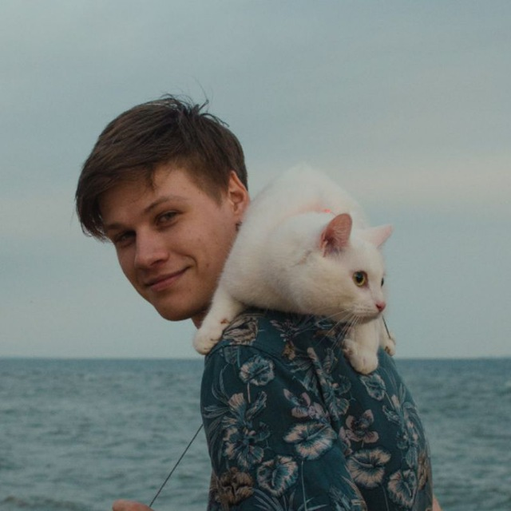

# Alexander Krylov



## Contacts

* **Telegram:** [@mraksdev](https://t.me/mraksdev)
* **E-mail:** <a.krylov.work@gmail.com>

RS-School Discord: mraksdev(@mraksdev)

## About

I'm Alexander Krylov, a recent graduate with a passion for game development and programming. During my academic journey, I focused on computer science, machine learning and web development. In my spare time, I am deeply engrossed in refining my skills as a game developer and coder.

## Skills

* **Languages:** HTML, CSS, Python, C++, C#
* **Frameworks & Libraries:** Vue.js, KivyMD, Pandas, Matplotlib, Scikit-learn, Numpy, Sass
* **Tools & Platforms:** Git, NPM
* **Design:** Figma, Photoshop, InDesign
* **Other:** Linux, Godot 4.0, Unity, Vim

## Code examples

### Python

1.Task is to make a function that can take any non-negative integer as an argument and return it with its digits in descending order. Essentially, rearrange the digits to create the highest possible number.

```Python
def descending_order(num):
    return int("".join(sorted([num for num in str(num)], reverse=True)))
```

2.Check to see if a string has the same amount of 'x's and 'o's. The method must return a boolean and be case insensitive. The string can contain any char.

```Python
def xo(s):
    s = s.lower()
    return s.count('x') == s.count('o')
```

## Education

### Bachelor of Control in Technical Systems

**St. Petersburg Electrotechnical University “LETI”**
*2018-2022*

### Lesta Game Academy

**Lesta Studio**
*2022*

### High-tech medical systems

**St. Petersburg Electrotechnical University “LETI”**
*2022*

## Experience

### Student Game Developer

**Lesta Studio** - St. Petersburg
*2022*

* Implemented game logics in Unity
* Helped troubleshoot and fix issues

[Link](https://github.com/mraksdev/IB_Prototypes) to Project Repo

### Mobile app development

**St. Petersburg Electrotechnical University “LETI”**
*2022*

* Developed front-end of mobile application using KivyMD
* Developed back-end of mobile application using Python
* Gained experience with various front-end technologies and tools
* Builded application for mobile devices using buildozer
* Created design of application
* Presented a mobile application to the jury and took first place among the participants

[Link](https://gitlab.com/mraksdev/stress-app) to Project Repo

## Languages

* **Russian** - Native
* **English** - C1
