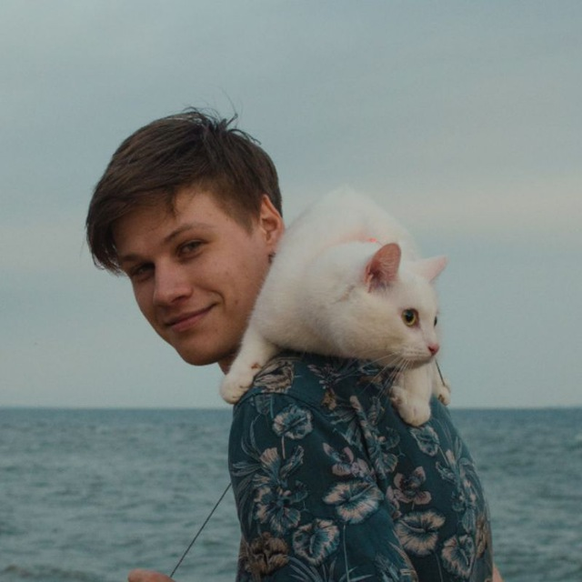

# Alexander Krylov

## Contacts

* **Telegram:** [@mraksdev](https://t.me/mraksdev)
* **E-mail:** <a.krylov.work@gmail.com>

RS-School Discord: mraksdev(@mraksdev)

## About

## Skills

* **Languages:** HTML, CSS, Python, C++, C#
* **Frameworks & Libraries:** Vue.js, KivyMD, Pandas, Matplotlib, Scikit-learn, Numpy, Sass
* **Tools & Platforms:** Git, NPM
* **Design:** Figma, Photoshop, InDesign
* **Other:** Linux, Godot 4.0, Unity, Vim

## Code examples

## Education

### Bachelor of Control in Technical Systems

**St. Petersburg Electrotechnical University “LETI”**
*2018-2022*

### Lesta Game Academy

**Lesta Studio**
*2022*

### High-tech medical systems

**St. Petersburg Electrotechnical University “LETI”**
*2022*

## Experience

## Languages

* **Russian** - Native
* **English** - C1
